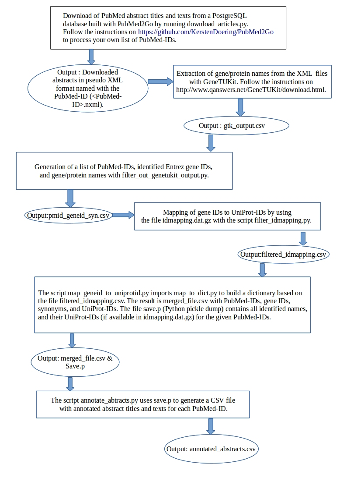

=========================================================
Protein Annotation of PubMed XML Abstracts with GeneTUKit
=========================================================

************
Introduction
************

- The following pipeline annotates genes/proteins in a set of PubMed abstracts with GeneTUKit.

- It uses PubMed2Go to build a PostgreSQL database from PubMed XML files that can be downloaded from NCBI.

- Start by copying the whole project folder from GitHub to your local disk.

- The pipeline was tested on a Linux system with Ubuntu 14.04.

- The following flow chart shows the order of the pipeline scripts and their input and output files.

****************************
Download of PubMed Abstracts
****************************

- The title and abstract part of requested PubMed XML documents can be accessed with PubMed2Go:

    - https://github.com/KerstenDoering/PubMed2Go

- The PubMed2Go documentation shows how to download a data set and build a PostgreSQL relational database. Follow the installation instructions. The part describing how to build a Xapian full text index is not needed here:

    - https://github.com/KerstenDoering/PubMed2Go/blob/master/documentation/quick_install.rst

- This documentation refers to the PubMed2Go example data set processing texts dealing with the disease pancreatic cancer.

- The two randomly selected abstracts with the PubMed-IDs 23215050 and 24842107 are selected from the PostgreSQL database and saved in the folder downloaded_abstracts in pseudo XML format. The script download_articles.py reads the file pubmed_id.txt which contains these two IDs.

- It is recommended to run this script in a separated subdirectory in order to have all NXML files together in an extra folder. The script can be run from this subdirectory:

    - python ../download_articles.py -i ../pubmed_id.txt

- Unfortunately, the plain text parameter in GeneTUKit does not work. That is the reason for using pseudo XML files. These XML tags are required to run GeneTUKit in XML mode and to recognise the title and text separately.

- The following steps cannot only be applied to PubMed XML abstracts, but any texts that are given in NXML format.

- NXML is a data structure used in BioCreAtIvE III and the example on the GeneTUKit homepage refers to this document:

    - http://www.qanswers.net/download/genetukit/1934391.nxml

- The mandatory XML structure used by GeneTUKit is <article><article-meta><title> TITLE </title><abstract>
 ABSTRACT 
</abstract></article-meta></article>.

- In XML documents, certain characters are not allowed in normal text, e.g. "<" and "&". Therefore they are escaped by the script and replaced with their ASCII codes.

*************************************
Gene/Protein Extraction wit GeneTUKit
*************************************

- The extraction of gene/protein names is done by running GeneTUKit and the output is saved in a CSV file.

- The latest version of GeneTUKit can be freely downloaded from http://www.qanswers.net/GeneTUKit/download.html.

- There is also a link providing the latest EntrezGene data set (gene_info.gz). This file has to be downloaded and copied into the EntrezGene directory of the downloaded GeneTUKit folder.

- To install GeneTUKit, follow the first four steps of GeneTUKit's help page, reachable at http://www.qanswers.net/GeneTUKit/help.html.

- As it has mentioned in its Readme.txt, it is possible to install the GeneTUKit on MySQL or PostgreSQL databases. In this pipeline, the MySQL version was tested. The modified config file should look like this:

     host name:
     DATABASE_HOST=localhost

     database name:
     DATABASE_NAME=EntrezGene

     username:
     DATABASE_USERNAME=genetukit

     password:
     DATABASE_PASSWORD=12345

     the table to store the gene data:
     DATABASE_GENEINFO_TABLE_NAME=gene_info

     database engine:
     DATABASE_DRIVER_NAME=mysql

     database driver:
     DATABASE_DRIVER_CLASS=com.mysql.jdbc.Driver

- Install the latest MySQL database client and server version. Possibly, the extra download of the jdbc driver JAR package for this database engine is needed. In this case, the JAR file needs to be renamed  to jdbc-driver.jar and copied into the lib folder of GeneTUKit.

- Running GeneTUKit with a single NXML file works as follows:

    - java -Djava.library.path=. -jar genetukit.jar -x downloaded_abstracts/23215050.nxml

- If you want to process multiple files at ones, use the batch mode by providing the folder name instead of a file name:

        - java -Djava.library.path=. -jar genetukit.jar -x downloaded_abstracts

- GeneTUKit is using CRF++ for NER (Name Entity Recognition), but it's possible to install and use BANNER for this purpose:

        - java -jar genetukit.jar -x downloaded_abstracts -banner > gtk_output.csv

        - With ">", the output is piped to the output file gtk_output.csv.

- The running time for this step on a test data set of 5000 abstracts was around 5 h with a 2 GHz single core CPU. 

******************************
Modifying the GeneTUKit output
******************************

- From the output given by GeneTUKit (e.g. gtk_output.csv), the required values PubMed-ID, gene ID and the synonyms are saved in a new CSV file named pmid_geneid_syn.csv:

    - python filter_out_genetukit_output.py -i gtk_output.csv

- GeneTUKit also provides organism IDs and a score for how likely each prediction is. These values are not further processed in this script, but it is reasonable to consider especially the prediction score.

**********************************
Mapping of UniProt-IDs to Gene IDs
**********************************

- Each gene ID provided by GeneTUKit has to be mapped to its respective UniProt-ID. Using UniProt-IDs brings up the advantage of directly accessing their sequenes. The UniProt-IDs are contained in idmapping.dat.gz. This file can be downloaded here:

    - ftp://ftp.ebi.ac.uk/pub/databases/uniprot/current_release/knowledgebase/idmapping/

    - The file idmapping.dat.gz also contains some unrelated information. By running filter_idmapping.py, only the related gene IDs and UniProt-IDs are saved in "filtered_idmapping.csv" file. The converted file is saved in the main directory.

- The process of mapping gene IDs from pmid_geneid_syn.csv to UniProt-IDs is done by map_geneid_to_uniprotid.py. By running this script, map_to_dict.py is used to build a dictionary from filtered_idmapping.csv. 

- It generates two output files.

    - The first file is merged_file.csv, which contains the mapped gene IDs and UniProt-IDs for each PubMed-ID with all identified synonyms.

    - The second file is a dictionary data structure (Python pickle file save.p) which contains all triples of PubMed-ID, synonym, and UniProt-ID.

- The script can be run without additional parameters:

    - python map_geneid_to_uniprotid.py

******************************
Annotation of PubMed Abstracts
******************************

- The gene/protein tags are added to the provided XML files with the following command: 

    - python annotate_abstracts.py -i downloaded_abstracts

- The script takes the path to the downloaded pseudo XML texts specified by the parameter "-i" and the list of synonym-UniProt-ID pairs saved in the dictionary save.p from the last step. The tagged abstract titles and texts are saved tab-separated in a CSV file named annotated_abstracts.csv, each row a new PubMed-ID (without pseudo XML tags).

- All abstract texts and titlse are separately searched for each synonym. The implementation takes care for nested tags in a way that it only highlights the longest matching synonym (function remove_nested_tagging()).

*******
Contact
*******

- Please, write an e-mail, if you have questions, feedback, improvements, or new ideas:

    - e_abbasian@yahoo.com

    - kersten.doering@pharmazie.uni-freiburg.de

- If you are interested in related projects, visit our working group's homepage:

    - http://www.pharmaceutical-bioinformatics.de

- This project is published with an ISC license given in "license.txt".
